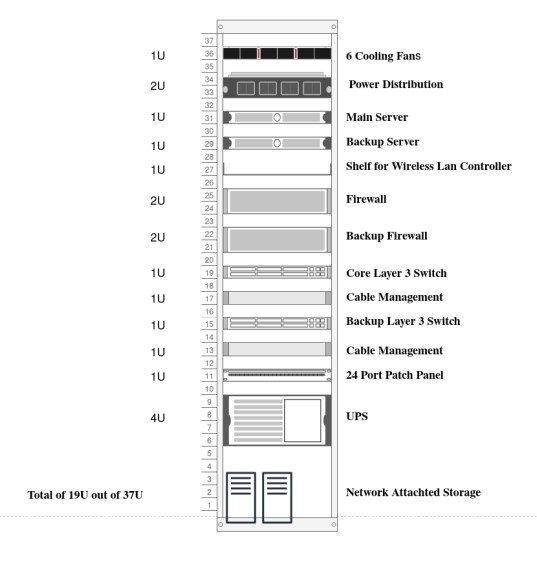

# Enhanced-Networking-Infrastructure

### Introduction
   Involved in the 2nd year Final Project of our Degree Program, Enhanced the Network Architecture/ VIrtualization and Solution for a Small-Medium Company with Advanced Technique andConcepts. Which was done through Apache Guamole to access high end pc to do Virtualization Practicals.

### Summary

The existing system implemented was in need to be upgraded to satisfy user requirements. Due to the increase in employees, different hierarchies were established and the
need for an email server was recognized to officially communicate within the hotel organization.The rate of data to be stored on the server increased day by day where storing it in the server itself was no longer practical and degraded the server performance. Therefore, an external Network Attached Storage(NAS) was introduced with ability to support large volumes of storage and RAID configuration for reliability and integration to an open-source file share platform. CCTV footage stored previously on the Network Video Recorder(NVR) device is now integrated to the NAS to provide better capacity and redundancy. The existing firewall was reaching its capacity and needed to be upgraded to a newer firewall. This new firewall is able to provide services such as implementing a proxy server and generating more efficient usage reports and also provide a more structured approach to load balancing the network traffic. The physical security of the infrastructure was improved by the addition of Biometric and RFID enabled door locks which can authenticate only authorized personnel and provide logging information on entry and exits. Network security was also achieved by using the AAA model rather than basic user
authentication where the administrator can decide which services and views can be accessed to which user according to the organizations hierarchy.

### Virtualization setup for a small-medium company.
- VMWare vSphere ESXI
- VMWare vSphere vCenter
- vMotion (Live Migration) 
- svMotion (Storage vMotion)
- VMWare vSAN
- VMWare vSphere DRS
- VMWare vSphere DPM

### Diagrams
 
 - [Devices Diagram](./Diagrams/DevicesDiagram.pdf)
 - [Ap Diagram](./Diagrams/ApDiagram.pdf)

### Images

- Server Rack Diagram 
 
 
 
 - Topology
 
 
